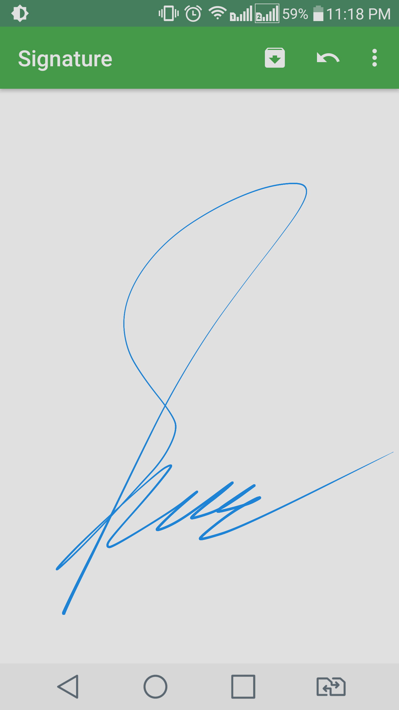

## This project is no longer maintained.
### It works fine, but you have to do bug fixes (if any) for yourself

# 1. Overview

SignatureView is an open source Android library which allow developers to produce pen and paper like effect for creating signatures on Android. 

#### 1.1 Play Store Demo App

Click below link to download demo app from Play store

**SignatureView Demo App image**

#### 1.2 Features

1. Smooth signatures
2. Auto handling of stroke thickness on the basis of velocity
3. Get signature as bitmap
4. Change stroke color and background color
5. Enable/Disable signature on canvas

See example code (SignatureView-Example) from repository for details.

## 2 Getting Started Using the Library

#### 2.1 Setup

Add the following to your `build.gradle`:
      
      repositories {
            jcenter()
      }
      
      dependencies {
          compile 'com.kyanogen.signatureview:signature-view:1.2'
      }

#### 2.2 How to use view in xml layout

        <com.kyanogen.signatureview.SignatureView
                xmlns:sign="http://schemas.android.com/apk/res-auto"
                android:id="@+id/signature_view"
                android:layout_width="match_parent"
                android:layout_height="match_parent"
                sign:penSize="5dp"
                sign:backgroundColor="#ffffff"
                sign:penColor="#000000"
                sign:enableSignature="true"/>

* First add Android XML **namespace**: xmlns:sign="http://schemas.android.com/apk/res-auto"
* **sign:penSize** = set pen stroke size; default value is 3dp
* **sign:backgroundColor** = set background color; default value is #FFFFFF
* **sign:penColor** = set pen stroke color; default value is #4169e1
* **sign:enableSignature** = enable/disable drawing signature on view

#### 2.3 Other functions

        SignatureView signatureView = (SignatureView) findViewById(R.id.signature_view);
        .
        .
        .

**Clear screen**

        signatureView.clearCanvas();
        
**Is Bitmap Empty**
        
        signatureView.isBitmapEmpty()

**Get SignatureView as bitmap**

        Bitmap bitmap = signatureView.getSignatureBitmap();

# 3. Changelog

[Click here](CHANGELOG.md) for the changelog

# 4. Developed by
Developed by <a href="https://www.linkedin.com/in/zahidsha/" target="_blank">Syed Zahid</a>. You can follow me on
<a href="https://twitter.com/XahidSha" target="_blank">Twitter</a>

# 5. License

Copyright 2015-2018

Licensed under the Apache License, Version 2.0 (the "License");
you may not use this file except in compliance with the License.
You may obtain a copy of the License at

    http://www.apache.org/licenses/LICENSE-2.0

Unless required by applicable law or agreed to in writing, software
distributed under the License is distributed on an "AS IS" BASIS,
WITHOUT WARRANTIES OR CONDITIONS OF ANY KIND, either express or implied.
See the License for the specific language governing permissions and
limitations under the License.
